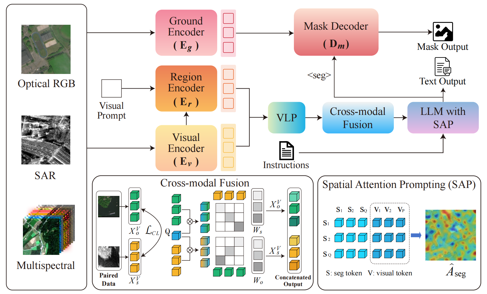

## EarthMind: Towards Multi-Granular and Multi-Sensor Earth Observation with Large Multimodal Models
<p align="center">
    🌐 <a href="" target="_blank">Blog</a> | 📃 <a href="https://arxiv.org/abs/2506.01667" target="_blank">Paper</a> | 🤗 <a href="https://huggingface.co/sy1998/EarthMind-4B" target="_blank">Model</a> |  🤗 <a href="https://huggingface.co/datasets/sy1998/EarthMind-data" target="_blank">Data</a> |  🎥 <a href="" target="_blank">Demo</a>

</p>

#### [Yan Shu <sup>1</sup>](https://shuyansy.github.io/), [Bin Ren <sup>1,4,5</sup>](https://amazingren.github.io/), [Zhitong Xiong <sup>3</sup>](https://zhitong-xiong.github.io/), [Danda Pani Paudel <sup>5</sup>](https://people.ee.ethz.ch/~paudeld/), [Luc Van Gool <sup>5</sup>](https://scholar.google.com/citations?user=TwMib_QAAAAJ&hl=en), [Begüm Demir <sup>2</sup>](https://rsim.berlin/), [Nicu Sebe <sup>1</sup>](https://scholar.google.com/citations?user=stFCYOAAAAAJ&hl=en), and [Paolo Rota <sup>1</sup>](https://paolorota.eu/)

<sup>1</sup> University of Trento, Italy, <br>
<sup>2</sup> Technische Universität Berlin, Germany, <br>
<sup>3</sup> Technical University of Munich, Germany, <br>
<sup>4</sup> University of Pisa, Italy, <br>
<sup>5</sup> INSAIT, Sofia University “St. Kliment Ohridski”, Bulgaria<br>


<p align="center">
    
</p>


✨ **Highlights**:

(i) The first multi-granular and multi-sensor Earth Observation LMMs. EarthMind can handle Optical (RGB and MultiSpectral) and SAR image perception and reasoning.

(ii) EarthMind achieves strong performance on several downstream EO tasks, including but not limited to Scene classification, VQA, Captioning and segmentation tasks. 

(iii) Proposing EarthMind-Bench, the first multi-sensor EO benchmarks, including 10 subtasks, evaluating the perception and reasoning ability of LMMs.


## News
- [2025/-/-] 🔥 The technical report of EarthMind is released.
- [2025/05/29] 🔥 EarthMind is released,  including data, model weight, training and evaluation code. 

## Model weights
Please download our pre-trained weights from the [link](https://huggingface.co/sy1998/EarthMind-Pretrain) and finetuned model weights from the [link](https://huggingface.co/sy1998/EarthMind-4B). 
  
## Installation 
```bash
conda create -n vlm python=3.10
conda activate vlm
conda install pytorch==2.3.1 torchvision==0.18.1 pytorch-cuda=12.1 cuda -c pytorch  -c "nvidia/label/cuda-12.1.0" -c "nvidia/label/cuda-12.1.1"
pip install mmcv==2.1.0 -f https://download.openmmlab.com/mmcv/dist/cu121/torch2.3/index.html
pip install -r requirements.txt
```

## Quick Start With HuggingFace

<details>
    <summary>Example Code</summary>
    
```python
import argparse
import os

from PIL import Image
from transformers import AutoModelForCausalLM, AutoTokenizer

import cv2
try:
    from mmengine.visualization import Visualizer
except ImportError:
    Visualizer = None
    print("Warning: mmengine is not installed, visualization is disabled.")


def parse_args():
    parser = argparse.ArgumentParser(description='Video Reasoning Segmentation')
    parser.add_argument('--image_folder', default="demo_images", help='Path to image file')
    parser.add_argument('--model_path', default="/scqian/EarthMind-4B")
    parser.add_argument('--work-dir', default="result", help='The dir to save results.')
    parser.add_argument('--text', type=str, default="<image>Please segment the left chimney.")
    parser.add_argument('--select', type=int, default=-1)
    args = parser.parse_args()
    return args


def visualize(pred_mask, image_path, work_dir):
    visualizer = Visualizer()
    img = cv2.imread(image_path)
    visualizer.set_image(img)
    visualizer.draw_binary_masks(pred_mask, colors='g', alphas=0.4)
    visual_result = visualizer.get_image()

    output_path = os.path.join(work_dir, os.path.basename(image_path))
    cv2.imwrite(output_path, visual_result)

if __name__ == "__main__":
    cfg = parse_args()
    model_path = cfg.model_path
    model = AutoModelForCausalLM.from_pretrained(
        model_path,
        torch_dtype="auto",
        device_map="cuda:0",
        trust_remote_code=True
    )

    tokenizer = AutoTokenizer.from_pretrained(
        model_path,
        trust_remote_code=True
    )

    image_files = []
    image_paths = []
    image_extensions = {".jpg", ".jpeg", ".png", ".bmp", ".gif", ".tiff"}
    for filename in sorted(list(os.listdir(cfg.image_folder))):
        if os.path.splitext(filename)[1].lower() in image_extensions:
            image_files.append(filename)
            image_paths.append(os.path.join(cfg.image_folder, filename))

    vid_frames = []
    for img_path in image_paths:
        img = Image.open(img_path).convert('RGB')
        vid_frames.append(img)


    if cfg.select > 0:
        img_frame = vid_frames[cfg.select - 1]

        print(f"Selected frame {cfg.select}")
        print(f"The input is:\n{cfg.text}")
        result = model.predict_forward(
            image=img_frame,
            text=cfg.text,
            tokenizer=tokenizer,
        )
    else:
        print("##########",vid_frames[0])
        print(f"The input is:\n{cfg.text}")
        result = model.predict_forward(
            video=vid_frames,
            text=cfg.text,
            tokenizer=tokenizer,
        )

    prediction = result['prediction']
    print(f"The output is:\n{prediction}")

    if '[SEG]' in prediction and Visualizer is not None:
        _seg_idx = 0
        pred_masks = result['prediction_masks'][_seg_idx]
        for frame_idx in range(len(vid_frames)):
            pred_mask = pred_masks[frame_idx]
            if cfg.work_dir:
                os.makedirs(cfg.work_dir, exist_ok=True)
                visualize(pred_mask, image_paths[frame_idx], cfg.work_dir)
            else:
                os.makedirs('./temp_visualize_results', exist_ok=True)
                visualize(pred_mask, image_paths[frame_idx], './temp_visualize_results')
    else:
        pass
```
</details>


## Training
Please download the training data and pretrained weights into the data folder and pretrained folder, and then run the following code. We recommend using 8 A100 GPUs for training. 
```bash
 bash tools/dist.sh train projects/llava_sam2/configs/earthmind_4b_sft.py 8
```

After training, please run the following script to convert models to hf format:
```bash
export PYTHONPATH="./:$PYTHONPATH"
python projects/llava_sam2/hf/convert_to_hf.py projects/llava_sam2/configs/earthmind_4b_sft.py --pth-model work_dirs/earthmind_4b_sft/iter_252380.pth --save-path your_model_path
```

## Evaluation
For image-level evaluation (scene classification, VQA and captioning), you can run 
```bash
bash scripts_eval/image_task_eval.sh
```
For region-level evaluation (region captioning), you can run 
```bash
bash region_task.sh
```
For pixel-level evaluation (segmentation), you can run 
```bash
bash pixel_task_eval.sh
```
For multispectral data evaluation, you can run 
```bash
bash multi_spectrum.sh
```
For EarthMind-Bench evaluation, you can run 
```bash
bash earthmind-bench.sh
```


## Training Data
We have released our training data in [link](https://huggingface.co/datasets/sy1998/EarthMind-data).

## Citation
If you find this repository useful, please consider giving a star :star: and citation

```
@misc{shu2025earthmindmultigranularmultisensorearth,
      title={EarthMind: Towards Multi-Granular and Multi-Sensor Earth Observation with Large Multimodal Models}, 
      author={Yan Shu and Bin Ren and Zhitong Xiong and Danda Pani Paudel and Luc Van Gool and Begum Demir and Nicu Sebe and Paolo Rota},
      year={2025},
      eprint={2506.01667},
      archivePrefix={arXiv},
      primaryClass={cs.CV},
      url={https://arxiv.org/abs/2506.01667}, 
}
```

## Acknowledgement
- Sa2VA and GlaMM: the codebase we built upon. 

## License
This project utilizes certain datasets and checkpoints that are subject to their respective original licenses. Users must comply with all terms and conditions of these original licenses.
The content of this project itself is licensed under the [Apache license 2.0](./LICENSE).


